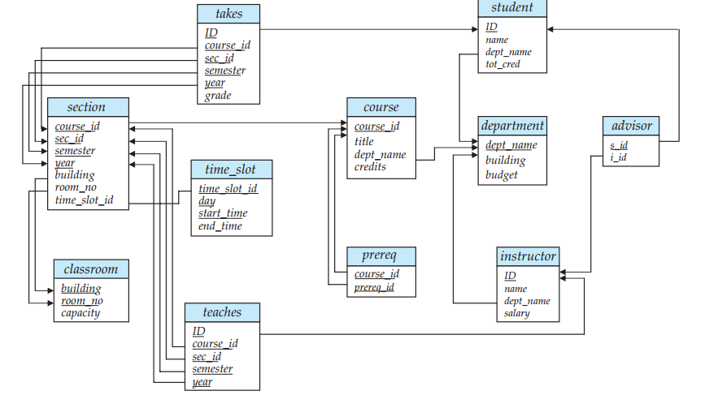

# DB II Project

## Prerequesites

- you should have [docker](https://www.docker.com/) installed on your device

## Installation

- clone the project

```bash
git clone https://github.com/Khader-1/DB-II-Project.git
```

- build it using docker compose

```bash
docker-compose up
```

- After build finishes you can access the app at port [`6868`](http://localhost:6868)

## ERD


